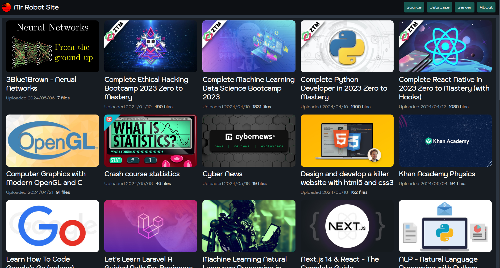
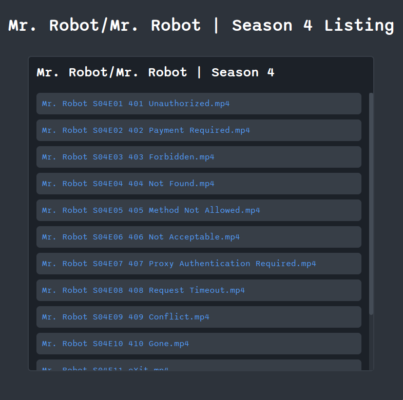

# MrRobot Site

Django app for hosting and streaming large videos. (courses & movies)

## Running the code

1. Clone the GitHub repository:
    ```shell
    $ git clone https://github.com/NickKipshidze/mrrobot-site
    ```
0. CD into the project directory:
    ```shell
    $ cd mrrobot-site
    ```
0. Create a new Python virtual environment and activate it (optional):
    ```shell
    $ python -m venv .venv
    ```
0. Install the dependencies:
    ```shell
    $ pip install -r requirements.txt
    ```
0. Configure sources in `settings.py`. Example configuration:
    ```python
    SOURCES = ["/home/user/Documents", "/home/user/Videos"]
    ```
0. Run the server:
    ```shell
    $ python manage.py runserver 127.0.0.1:8000
    ```

## Setting up SSL (self-signed)

1. Make the certificates directory:
    ```shell
    $ mkdir certs
    ```

0. Generate the certificate:
    ```shell
    $ openssl req -x509 -newkey rsa:4096 -keyout ./certs/key.pem -out ./certs/cert.pem -days 365 -nodes
    ```
0. Run the server:
    ```shell
    $ gunicorn --certfile=./certs/cert.pem --keyfile=./certs/key.pem -b 0.0.0.0:8000 mrrobot.wsgi:application
    ```

Enjoy your suspicious website with an invalid SSL certificate.

## Website preview

### Home page


On the home page there are directories of `SOURCES` listed. If there is file called `.mrignore` in a directory it doesnt list it.

### Directory listing page


Site design may change often.